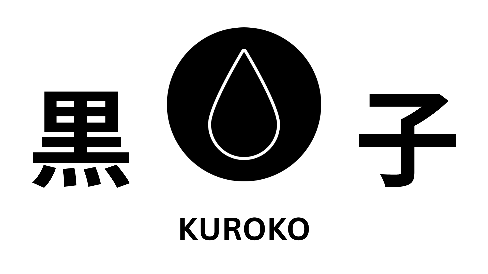

# Kuroko (黒子) – Stealth Interview Co-Pilot

> *To exist without being seen. To help without being heard.*

Kuroko is a high-performance, stealth-focused desktop assistant designed for technical interviews. It leverages local hardware for audio processing and RAG (Retrieval Augmented Generation) while orchestrating cloud-based LLMs for intelligence, ensuring privacy, low latency, and zero detection.

---

## 🎥 Demo

The interface visible above is seen **only by the user**.
To an interviewer viewing your screen via Zoom, Teams, or OBS, the desktop appears completely empty.

[](https://youtu.be/W8_Z1CVzPLQ)

---

## 🧠 Engineering Methodology

This project was built on three core pillars:

* **Invisibility**
* **Latency**
* **Privacy**

---

## 1. Stealth Architecture (Anti-Detection)

Unlike browser extensions or meeting bots, Kuroko runs entirely outside the meeting context.

### Visual Invisibility

* Uses the Win32 `SetWindowDisplayAffinity` API with `WDA_EXCLUDEFROMCAPTURE`
* Renders the UI strictly to the user's physical monitor
* Bypasses the DWM bitstream sent to screen-sharing software (Zoom, Teams, OBS)
* Toggleable for OBS recording

### Process Camouflage

* Uses `WS_EX_TOOLWINDOW` extended window styles
* Hides the application from the Taskbar and Task Manager “Apps”
* Masquerades as a background system process

### Decoy Strategy

* Configurable **Masquerade Mode**
* Alters process title and icon at runtime
* Examples: *Calculator*, *Runtime Broker*
* Designed to evade manual inspection

---

## 2. Latency Optimization (The <200ms Goal)

Speed is non-negotiable. Every millisecond was engineered out.

### Producer–Consumer Audio Pipeline

* Replaced standard event loops with `System.Threading.Channels`
* Listener (Producer) slices audio via VAD and pushes to an unbounded queue
* Composer (Consumer) transcribes in parallel
* Guarantees zero audio loss and minimal blocking

### Network Tuning

* Enforces HTTP/2
* Maintains warmed-up connection pools via `SocketsHttpHandler`
* Eliminates repeated SSL/TLS handshake overhead

### Streaming Pipeline

* Uses `IAsyncEnumerable` with Server-Sent Events (SSE)
* Tokens render instantly as they arrive
* No waiting for full completion

### SIMD Vector Search

* Uses `System.Numerics.Tensors`
* Hardware-accelerated cosine similarity
* Instant retrieval from the local RAG database

---

## 3. Local-First Privacy (RAG)

Sensitive data never permanently leaves the machine.

### Ingestion

* `PdfPig` extracts text from PDF resumes and CVs

### Vector Store

* Chunked and stored in a local SQLite database

### Retrieval

* Embeddings generated on demand
* Only relevant chunks are sent to the cloud LLM
* Full resume is never exposed to provider training data

---

## 🛠 Tech Stack

* **Language:** C# / .NET 10
* **UI Framework:** WPF (Windows Presentation Foundation)
* **Audio Engine:** NAudio (WASAPI Loopback Capture)
* **Transcription:** Whisper.net (local C++ bindings)
* **AI Orchestration:** Semantic Kernel / Custom OpenRouter Client
* **Database:** SQLite (with vector logic)

---

## 🚀 Getting Started

### Prerequisites

* **OS:** Windows 10/11 (x64)
* **Runtime:** .NET 10 SDK
* **Hardware:** Microphone + Speakers
  Headphones recommended to prevent feedback

### Installation

```bash
git clone https://github.com/hyowonbernabe/Kuroko.git
```

1. Open `Kuroko.sln` in Visual Studio
2. Restore NuGet packages
3. Create a `.env` file in the root directory
4. Build and Run (`Ctrl + F5`)

---

## ⚙ Configuration (`.env`)

Create a `.env` file in the project root:

```env
OPENROUTER_API_KEY=sk-or-v1-your-key-here
OPENROUTER_MODEL=google/gemma-3-27b-it:free

# Window Behavior
WINDOW_TOPMOST=True
DEEP_STEALTH=False
SCREEN_SHARE_PROTECTION=True

# Hotkeys (Modifiers + Key)
HOTKEY_TRIGGER_TXT=Alt + S
HOTKEY_PANIC_TXT=Alt + Q
HOTKEY_CLEAR_TXT=Alt + C

# Masquerade (Optional)
DECOY_TITLE=Host Process
DECOY_ICON=

# Persona (System Prompt)
SYSTEM_PROMPT=You are Kuroko, an invisible interview assistant...
```

---

## 📦 Deployment (Building the Executable)

To deploy Kuroko as a standalone `.exe` with no installer:

```bash
dotnet publish Kuroko.UI/Kuroko.UI.csproj \
  -c Release \
  -r win-x64 \
  --self-contained true \
  -p:PublishSingleFile=true \
  -p:IncludeNativeLibrariesForSelfExtract=true
```

Output location:

```
\bin\Release\net9.0-windows\win-x64\publish\
```

---

## 🎮 Usage Guide

### 1. Initialization

* Launch Kuroko
* Appears as a small toolbar at the bottom-left
* Click **INITIALIZE**
* Status changes to **ACTIVE**

Ensure audio is playing or speaking to verify capture.

---

### 2. Knowledge Base (RAG)

* Open **SYSTEM CONFIG → KNOWLEDGE BASE**
* Upload your Resume or Technical CV (PDF)
* Data is parsed, chunked, and stored in `kuroko_rag.db`
* Files can be managed or wiped at any time

---

### 3. Interview Trigger

* **Trigger (Alt + S):** Capture context and stream answers
* **Clear Context (Alt + C):** Reset transcription buffer
* **AI Insight:** Markdown-rendered floating overlay

---

### 4. Customization

* **Persona:** Edit the System Prompt to control behavior
* **Stealth:**

  * Toggle *Deep Stealth* to hide from Taskbar
  * Toggle *Screen Share Protection* for OBS or Zoom

---

### 5. Panic Mode

* Press **Alt + Q**
* Immediately terminates the application process

---

## 🛡 Disclaimer

This software is intended for educational purposes and personal assistance only.
Users are responsible for complying with platform terms of service and any agreements they have entered into.
